# The-Worm-Era-Bug-Bounty-Writeups

# 2000$ Bounty
## Unauthorized Access to User Credentials via API
For the first app, we were introduced to this login page: 

We try to use any credentials to see how the server reacts to our request ( without Burpsuite )

We get `Invalid credentials. Please try again.` but looking at the URL `http://104.248.132.249:5000/api/v1/login` we can see that there's an API named login who gets the post requests.

I tried to play with that endpoint by changing the request method to `OPTIONS` or `PATCH`  but nothing came helpful as the methods were not allowed.

Then i switched my tests to finding another vulnerable API endpoint so i started manual fuzzing for common ones, and ended up finding this `http://104.248.132.249:5000/api/v1/users`  which got us all the 3 usernames in the app, 
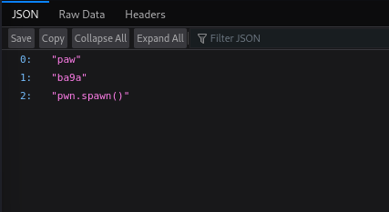

Basically now we should start looking for the endpoint where the server is storing the users infos. I just added the username `paw` to the URL and we got a finding 
here : `http://104.248.132.249:5000/api/v1/users/paw`

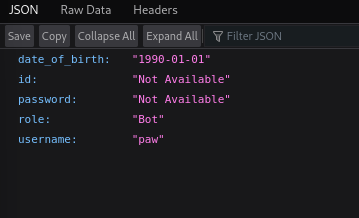

A bot account won't help us so we continue to see the other users.
Trying the user pwn.spawn() we can find a password ! 
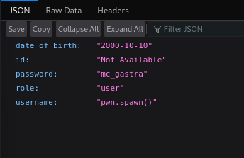

Now we got some credentials `pwn.spawn():mc_gastra` to login to the app we can start seeing other vulnerabilities.
And we logged in ! 
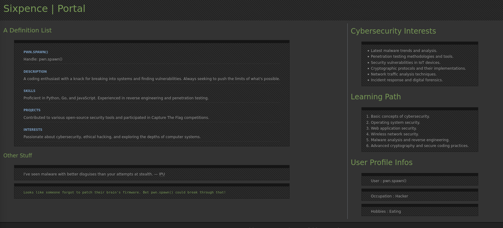
## Broken Access Control via URL 

All the text in the website won't help us with nothing that's why we keep our focus on the URL again we see as we login the URL becomes like this : 
`http://104.248.132.249:5000api/v1/user/pwn.spawn()/b878392e36f022fe2b18d474ed5a3c3f`

First thing to come in mind is to check how the server reacts if we change the username in the URL to another one from our previous findings.
and it magically worked we can get access to any account just by changing the username in the URL 
`http://104.248.132.249:5000api/v1/user/{pwn.spawn()|ba9a|paw}/b878392e36f022fe2b18d474ed5a3c3f`

Another thing was concerning is what if hash was giving any significant role or other access to some features in the app that's why we need to identify its type and try to get its content with any tool/website. 

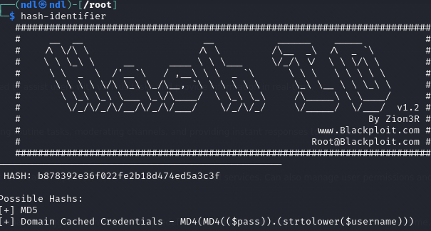

Trying to crack this hash won't help in anything but one last thing was i tried to md5 hash the username and compare the results :
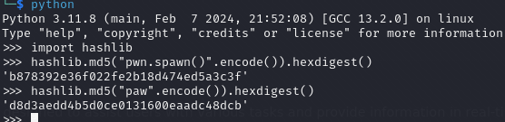

And we got a match so now we get what the Author tried to do : 
`http://104.248.132.249:5000/api/v1/user/username/{md5(username)}/

So the point is if there was a user named admin we can access his account by this URL

`http://104.248.132.249:5000/api/v1/user/admin/21232f297a57a5a743894a0e4a801fc3

where md5("admin") = "21232f297a57a5a743894a0e4a801fc3"

But with my first finding we can put any character in the hash value and we get full user access.

Getting back to the `admin` user example, we can get access with only this URL

`http://104.248.132.249:5000/api/v1/user/admin/2` 
as the server seems to check if there's a value only not md5 decode it and checks if the value matches the username.

# 5000$ Bounty
## High Severity Server Side Request Forgery

Next one, same thing we get a login page but this time with the username and the password given:
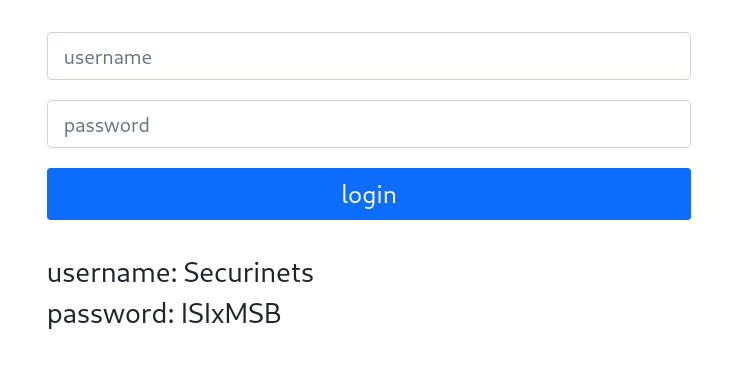

As we login, we can see that you can give this app any url and it'll render it for you in the front.
I tried some basic example like `https://youtube.com` and it worked i got youtube website rendered, you get the point.

At this point, i tried to read some files the author had in the app by trying 
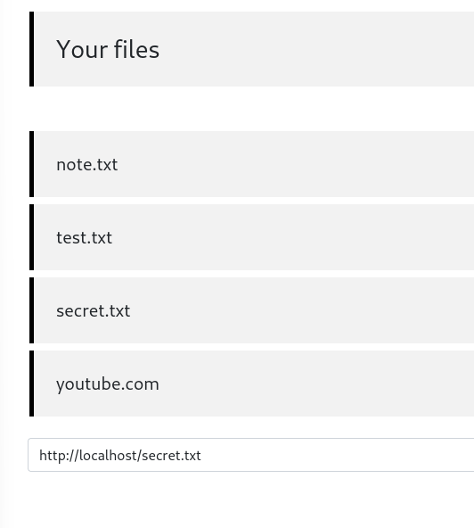

but we get `invalid url` even if the files are there, that's why i first thought of bypassing the localhost filters with something like this for example `http://0/` or like this `⓵⓶⓻.⓿.⓿.⓵` also i thought of the option of using shortened URLs like the ones you see in `bit.ly` but again  none of that worked we still get `invalid url`
that's why i switched sides to trying to redirect the request with a webhook which is basically a is a simple combination of _web_, referring to its HTTP-based communication, and the _hooking_ programming function that allows apps to intercept calls or other events that might be of interest. 
In our case, we need to redirect the user to the server's localhost by simply another url like this one `https://eop6suubadsqia4.m.pipedream.net`
and here's how it was configured 

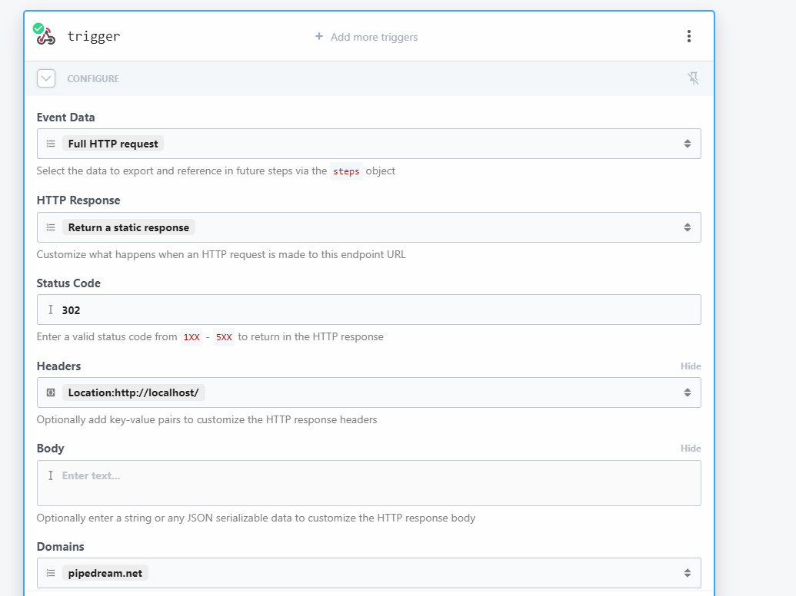

What we need to focus on is the Location in Headers which like i said allows us to have a Server Side Request Forgery.
As soon we use the webhook URL and submit , we get another response which is `not found` and we're happy with that ! 
But the problem now that we need a lot of fuzzing and the fact that everything i have to do is manual and every time i get a new URL to test with is tiring.
That's why i switched to try finding another solution to further exploit the vulnerability.
I tried writing an AJAX script to automate fuzzing but it didn't work as the server didn't filtered the requests or idk why exactly.
A few hours later i learned about DNS rebinding which is a method of manipulating resolution of domain names that is commonly used as a form of computer attack. In this attack, a malicious web page causes visitors to run a client-side script that attacks machines elsewhere on the network.
This website is the simplest and the best for such thing : [dnsrebinder](https://lock.cmpxchg8b.com/rebinder.html)

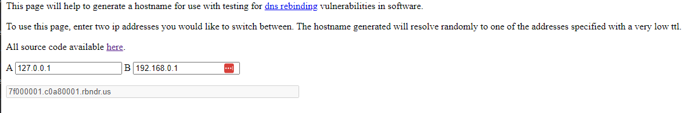

the thing is that we can't use any ip address for B, it should be a dynamic one so let's go back to youtube.com and get its @ip 
A simple command like nslookup can do the job :

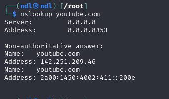

and we try again posting the request with the new URL `7f000001.8efbd12e.rbndr.us`
This time we gonna need to send multiple requests that's why working with burp is easier.

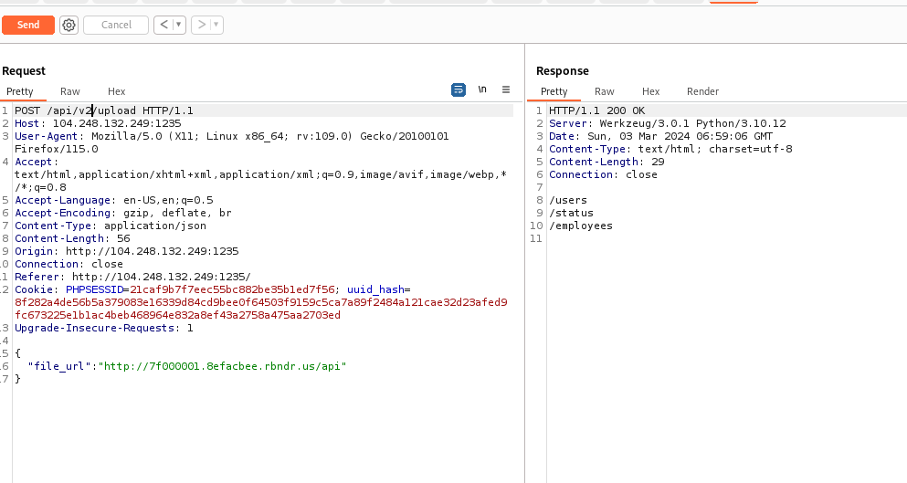

After some requests to those endpoints we got the users uuid hashes 

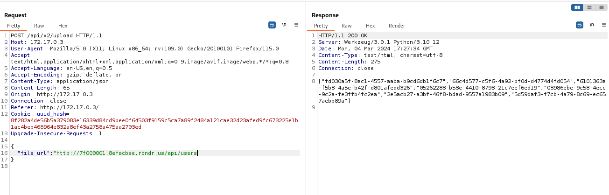

The other two endpoints return us text results :

/status : `site is up`
/employees : `we currently have 1337 active employees`

We can now use any uuid to get access to the website users which won't help with anything at this point.

# Final Thoughts :

I won't be posting the 50$ writeup because it was solved by mostly all teams. 
Anyways thanks for the challenges i enjoyed them. 
